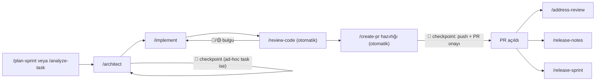

# AI Dev Team Workflows

12 workflow dosyası, tek bir AI coding agent'ı sırayla farklı yazılım ekibi
rollerine büründürerek uçtan uca bir **"task → analiz → mimari → kod → review →
PR"** hattı çalıştırır: Business Analyst, Software Architect, Senior Developer,
Code Review Sentinel, QA Engineer, DevOps/Release Manager, PR Author, Project
Manager, Scrum Master, Release Notes Writer, Release Manager, UI Designer.

Fikir basit: her rol için ayrı bir prompt/kural seti yazılmış; siz `/implement
TASK-01` dediğinizde agent "Senior Developer" şapkasını takıp mimariyi okur,
kodu yazar, kendi kendine code review'dan geçirir ve PR'a hazırlar — her adımda
ne yaptığını raporlayarak, kritik noktalarda (git push, PR açma, store'a
gönderim gibi geri alınması zor işlemlerde) sizden onay bekleyerek.

Workflow'ların çağrılma mekanizması (`workflows/*.md`, `/komut-adı` ile
tetiklenir) [Google Antigravity](https://antigravity.google) formatındadır,
ama proje bağlam dosyası (`AGENTS.md`) ve içerik tamamen taşınabilir plain
Markdown olduğu için Claude Code, Cursor, Windsurf, Codex CLI gibi araçlara da
kolayca uyarlanır — bkz. [Desteklenen AI Araçları](#desteklenen-ai-araçları).

## İçindekiler

- [Ön Koşullar](#ön-koşullar)
- [Hızlı Başlangıç](#hızlı-başlangıç)
- [Örnek Kullanım](#örnek-kullanım)
- [Workflow Referansı](#workflow-referansı)
- [Bu Şablonun Varsaydığı Proje Yapısı](#bu-şablonun-varsaydığı-proje-yapısı)
- [Desteklenen AI Araçları](#desteklenen-ai-araçları)
- [Repo Yapısı](#repo-yapısı)
- [Özelleştirme Notları](#özelleştirme-notları)
- [Sık Sorulan Sorular](#sık-sorulan-sorular)

## Ön Koşullar

- **Bir AI coding agent**: [Google Antigravity](https://antigravity.google)
  (workflow'lar doğrudan bu format için yazıldı) veya `AGENTS.md` standardını
  destekleyen başka bir araç (bkz. [Desteklenen AI Araçları](#desteklenen-ai-araçları)).
- **Git** ve **[GitHub CLI (`gh`)](https://cli.github.com/)**, `gh auth login`
  ile giriş yapılmış olarak — workflow'lar issue açma, PR oluşturma, milestone
  yönetimi gibi işlemler için `gh`'ı kullanır.
- **Bir GitHub reposu** — workflow'lar bir git projesi ve (opsiyonel ama
  önerilen) bir GitHub issue tracker'ı olduğunu varsayar.
- Mobil bir proje geliştiriyorsanız ve `release-sprint.md`'yi kullanacaksanız:
  [Fastlane](https://fastlane.tools/) ve App Store Connect / Play Console
  erişimi. Kullanmıyorsanız bu workflow'u yok sayabilirsiniz.

## Hızlı Başlangıç

1. **Repoyu klonlayın:**
   ```bash
   git clone https://github.com/barisgorgun/ai-dev-team-workflows.git
   cd ai-dev-team-workflows
   ```
2. **Kurulum script'ini çalıştırın:**
   ```bash
   ./install.sh
   ```
   Script size hangi AI aracını kullandığınızı (Antigravity / Claude Code /
   diğer), workflow'ları global mi yoksa tek bir projeye mi kurmak
   istediğinizi ve hedef proje klasörünü sorar; ardından `workflows/*.md` ve
   `AGENTS.md`/`CLAUDE.md`/`GEMINI.md` dosyalarını doğru yerlere kopyalar.
   Var olan bir dosyanın üzerine yazmadan önce her zaman sorar.

   <details>
   <summary>Script'i kullanmadan elle kurmak isterseniz</summary>

   Workflow'ları kopyalayın:
   ```bash
   # Global (tüm workspace'lerde kullanılabilir)
   cp workflows/*.md ~/.gemini/antigravity/global_workflows/     # Antigravity
   cp workflows/*.md ~/.claude/commands/                          # Claude Code

   # Workspace-özel (yalnızca tek bir proje)
   mkdir -p <proje-kökü>/.agent/workflows && cp workflows/*.md <proje-kökü>/.agent/workflows/    # Antigravity
   mkdir -p <proje-kökü>/.claude/commands && cp workflows/*.md <proje-kökü>/.claude/commands/     # Claude Code
   ```
   Context dosyalarını (symlink'ler dahil) kopyalayın:
   ```bash
   cp -P AGENTS.md CLAUDE.md GEMINI.md <proje-kökü>/
   ```
   (`-P` bayrağı symlink'leri symlink olarak kopyalar, içeriğini kopyalamaz.)
   </details>

3. `AGENTS.md`'yi (hedef projenizde) açıp kendi projenizin
   mimarisine/standartlarına göre doldurun.
4. **Docs iskeletini oluşturun** (opsiyonel ama önerilir — bkz.
   [Proje Yapısı](#bu-şablonun-varsaydığı-proje-yapısı)):
   ```bash
   mkdir -p <proje-kökü>/docs/tasks <proje-kökü>/docs/decisions <proje-kökü>/docs/sprints
   touch <proje-kökü>/docs/backlog.md <proje-kökü>/docs/progress.md <proje-kökü>/docs/releases.md
   ```
5. **Antigravity'yi açın** (zaten açıksa workflow listesini yenilemesi için
   yeniden başlatmanız gerekebilir) ve projenizi workspace olarak açın.
6. Agent chat panelinde `/plan-sprint`, `/architect`, `/implement` gibi
   komutları yazarak çağırın.

## Örnek Kullanım

Sıfırdan bir feature isteğinden PR'a kadar tipik bir akış:

```
Siz:    /plan-sprint "Kullanıcı profiline avatar yükleme özelliği ekle"

Agent:  [PM rolü] İsteği TASK-042 olarak parçalıyor, Business Analyst ve
        Architect rollerini arka arkaya çalıştırıp analiz + mimari
        dokümanını dolduruyor, ardından tek bir onay ekranı gösteriyor:

        ## Sprint 7 Planı Hazır
        ### Task Özeti
        | TASK-042 | Avatar yükleme | M | Must | — |
        Bu planı onaylıyor musun? [1] Onayla [2] Değişiklik var [3] Detay göster

Siz:    1

Agent:  GitHub issue #58 açıldı, docs/backlog.md ve docs/progress.md
        güncellendi.

Siz:    /implement TASK-042

Agent:  [Senior Developer rolü] Analiz + mimariyi okuyor, TDD ile önce test
        iskeletini kuruyor, Domain → Data → Presentation sırasıyla kodu
        yazıyor, derliyor. Kod derlendikten sonra durmadan devam ediyor:

        [Code Review Sentinel] 🔴 0  🟡 0  🟢 2 → docs/progress.md "PR Hazır"
        [DevOps hazırlığı] Commit mesajı + PR description taslağı hazır

        ## Branch & PR Onayı
        feature/TASK-042-avatar-yukleme → base: main
        Onaylıyor musun?

Siz:    Onaylıyorum

Agent:  Commit + push + PR: https://github.com/.../pull/59
        docs/progress.md → "Done" (merge bekliyor)
```

Ertesi gün durumu görmek için `/daily-standup`; PR'a reviewer yorumu
gelince `/address-review`; sprint kapanınca `/release-notes` ve (mobil
projelerde) `/release-sprint`.

## Workflow Referansı

| Komut | Rol | Ne yapar | Kullanım |
|-------|-----|----------|----------|
| `/analyze-task "..."` | Business Analyst | Kaba bir isteği acceptance criteria + edge case'leri olan bir Task Analysis Document'a çevirir | Standalone veya `/plan-sprint` içinden |
| `/architect [TASK-ID]` | Software Architect | Analiz edilmiş bir task için katman/dosya planı ve (gerekirse) ADR üretir | Standalone veya `/analyze-task` sonrası |
| `/implement [TASK-ID]` | Senior Developer | Mimariyi kodlar (TDD), derler, **otomatik olarak** review + PR hazırlığına geçer | Ana giriş noktası |
| `/review-code` | Code Review Sentinel | Git diff'i 10 kategoride denetler (memory/thread safety, security, architecture, edge case'ler, testability, readability...) | Standalone veya `/implement` içinden |
| `/run-tests` | QA Engineer | Test suite'i çalıştırır, başarısız testler için önce kök neden analizi (RCA) yapar | Standalone |
| `/create-pr` | DevOps / Release Manager | Commit mesajı + PR description hazırlar, onay sonrası push + PR açar | Standalone veya `/implement` içinden |
| `/address-review [PR#]` | PR Author | Açık PR'daki reviewer yorumlarını [FIX]/[REPLY]/[DEFER] olarak sınıflandırıp yanıtlar | Standalone |
| `/plan-sprint "..."` | Project Manager | Bir isteği task'lara böler, batch modda analiz+mimari üretir, sprint planını tek checkpoint'te onaya sunar | Ana giriş noktası |
| `/daily-standup` | Scrum Master | Backlog/progress/git log'dan günlük durum raporu üretir, sprint kapanışını tetikler | Standalone |
| `/release-notes [sprint]` | Release Notes Writer | Kapanan sprint işlerini App Store/Play Store "What's New" metnine çevirir | Standalone |
| `/release-sprint [sprint]` | Release Manager | Release branch'i sürüme dönüştürür: version bump → main merge → store submission | Standalone (mobil) |
| `/design-screen "..."` | UI Designer | Bir AI tasarım aracı için (Stitch AI vb.) detaylı UI prompt'u üretir | Standalone veya `/implement` içinden |

Pipeline zinciri: **`/plan-sprint` (veya `/analyze-task`) → `/architect` →
`/implement`** — `/implement` başarılı derlemeden sonra kullanıcıya sormadan
`/review-code` → `/create-pr` hazırlığını otomatik yürütür; tek durak, en
sondaki branch/PR onayıdır.



## Bu Şablonun Varsaydığı Proje Yapısı

Workflow'lar aşağıdaki dosya/klasörlere okur-yazar. Hiçbiri zorunlu değil — ilk
çalıştırmada kendileri oluşturulabilir — ama boş bir iskelet hazırlamak akışı hızlandırır:

```
AGENTS.md                          # Proje kuralları (bkz. "Desteklenen AI Araçları")
docs/
├── architecture.md                # Katman yapısı, dosya organizasyonu kuralları
├── coding-standards.md            # Kod yazım standartları
├── review-checklist.md            # Code review kontrol listesi
├── backlog.md                     # Task listesi, sıradaki TASK-ID kaynağı
├── progress.md                    # Güncel sprint panosu (To Do / In Progress / ...)
├── releases.md                    # Sürüm kaydı
├── decisions/                     # Mimari kararlar (ADR'ler, opsiyonel)
├── sprints/sprint-NN-summary.md   # Kapanan sprint özetleri
├── sprint-history.md              # Sprint kapanış indeksi
└── tasks/sprint-XX/
    ├── TASK-{ID}-analysis.md      # /analyze-task çıktısı + /architect'in eklediği bölüm
    ├── TASK-{ID}-result.md        # /implement teslimat raporu
    ├── TASK-{ID}-review.md        # /review-code raporu
    └── TASK-{ID}-rca.md           # /run-tests kök neden analizi (gerektiğinde)
```

Bu dosya adları/yolları **örnektir** — projenizde farklı bir konvansiyon varsa
`workflows/` içindeki dosyaların yol referanslarını bulup değiştirin (`docs/` geçen satırlar).

## Desteklenen AI Araçları

Proje bağlam/kural dosyası olarak tek bir kaynak var: **`AGENTS.md`**. Bu, 2026
itibarıyla OpenAI Codex, GitHub Copilot, Cursor, Windsurf, Amp, Devin, Aider,
Zed, Jules, JetBrains Junie ve Claude Code dahil çoğu aracın **native olarak**
okuduğu açık standarttır ([agents.md](https://agents.md)).

Claude Code ve Gemini CLI/Google Antigravity kendi isimlerindeki dosyayı arar;
bu yüzden `CLAUDE.md` ve `GEMINI.md`, `AGENTS.md`'ye **sembolik link** olarak
repoda hazır bulunuyor — üç dosyayı ayrı ayrı güncel tutmanıza gerek yok:

| Araç | Okuduğu dosya | Bu repodaki karşılığı |
|------|----------------|------------------------|
| Claude Code | `CLAUDE.md` | symlink → `AGENTS.md` |
| Gemini CLI / Google Antigravity | `GEMINI.md` | symlink → `AGENTS.md` |
| Codex CLI, Copilot, Cursor, Windsurf, Amp, Devin, Aider, Zed, Jules, JetBrains Junie | `AGENTS.md` | doğrudan |

Kendi projenize kurarken bu üç dosyayı da birlikte kopyalayın (`git clone` zaten
symlink'leri korur; ayrı ayrı kopyalarken `cp -P` kullanın ki symlink olarak
kalsınlar). Listede olmayan bir araç kullanıyorsanız aynı deseni kendiniz
uygulayabilirsiniz: `ln -s AGENTS.md <aracın-beklediği-dosya-adı>`.

Workflow'ların **çağrılma mekanizması** (`workflows/*.md`, `/komut-adı`) ise
Antigravity'ye özgüdür — Claude Code kendi custom command'larını
`.claude/commands/*.md` altında bekler, Cursor `.cursor/rules/` kullanır vb.
İçerik aynı kalır, yalnızca dosyaları o aracın beklediği klasöre kopyalamanız
(gerekirse frontmatter eklemeniz) yeterlidir.

## Repo Yapısı

```
ai-dev-team-workflows/
├── README.md
├── LICENSE
├── install.sh             # İnteraktif kurulum script'i
├── AGENTS.md              # Proje bağlam dosyası (kanonik)
├── CLAUDE.md              # symlink → AGENTS.md
├── GEMINI.md              # symlink → AGENTS.md
└── workflows/
    ├── analyze-task.md      # Business Analyst
    ├── architect.md         # Software Architect
    ├── implement.md         # Senior Developer
    ├── review-code.md       # Code Review Sentinel
    ├── run-tests.md         # QA Engineer
    ├── create-pr.md         # DevOps / Release Manager
    ├── address-review.md    # PR Author
    ├── plan-sprint.md       # Project Manager
    ├── daily-standup.md     # Scrum Master
    ├── release-notes.md     # Release Notes Writer
    ├── release-sprint.md    # Release Manager (store submission)
    └── design-screen.md     # UI Designer (prompt engineer)
```

## Özelleştirme Notları

- **Tek repo varsayılır.** Backend/mobil gibi birden fazla repo yönetiyorsanız
  `docs/...` yol referanslarını ve `gh` komutlarındaki `<owner>/<repo>` yer
  tutucularını kendi yapınıza göre düzenleyin; gerekirse çoklu-repo döngülerini
  (`for repo in ...`) geri ekleyin.
- **Mobil örnekler.** `design-screen.md`, `release-sprint.md`, `implement.md` ve
  `review-code.md` içindeki iOS/Android, SwiftUI/Compose, App Store/Play Store
  örnekleri mobil app geliştirme senaryosundan geliyor — web/backend projelerinde
  ilgili örnekleri kendi stack'inize göre değiştirin, workflow'un adım mantığı aynı kalır.
- **ADR/karar kayıtları.** Kurallar kendi içinde açıklanmış durumda (dışarıdan bir
  "ADR-XXX" numarasına referans vermiyor). Kendi projenizde karar kayıtları
  tutuyorsanız `docs/decisions/`'a referans eklemek isteyebilirsiniz.
- **Marka/ton.** `release-notes.md` "What's New" metinlerinin tonunu placeholder
  olarak bırakır — kendi ürününüzün marka sesini siz tanımlarsınız.

## Sık Sorulan Sorular

**Antigravity dışında bir araç kullanıyorum, yine de işe yarar mı?**
Evet — `AGENTS.md`/`CLAUDE.md` proje bağlamını her araç zaten okuyacaktır.
Yalnızca workflow'ların *çağrılma mekanizması* Antigravity'ye özgü; başka bir
araçta `workflows/*.md` içeriğini o aracın custom command/rule konvansiyonuna
kopyalamanız yeterli (bkz. [Desteklenen AI Araçları](#desteklenen-ai-araçları)).

**Tek başıma çalışıyorum, sprint/backlog süreci gerekli mi?**
Hayır. `/plan-sprint` ve `/daily-standup`'ı hiç kullanmadan doğrudan
`/analyze-task` → `/architect` → `/implement` zinciriyle de çalışabilirsiniz;
"sprint" kavramı yalnızca `docs/tasks/sprint-XX/` klasörlemesi için kullanılır,
gerçek bir Scrum süreci şart değildir.

**Workflow bir git komutunu (push, PR) benden sormadan mı çalıştırıyor?**
Hayır. Her workflow, geri alınması zor işlemlerden (commit/push/PR/store
submission) önce **açık bir onay noktası (🔴 CHECKPOINT)** içerir ve o ana
kadar salt-okunur ilerler. Analiz/kod yazma gibi geri alınabilir adımlar
onaysız devam eder.

**`docs/` altındaki dosyaları elle mi oluşturmam gerekiyor?**
Hayır, workflow'lar eksik dosyaları ilk çalıştırmada kendileri oluşturur.
Elle bir iskelet hazırlamak yalnızca ilk çalıştırmayı hızlandırır.

**Mobil değilim (web/backend); `design-screen`, `release-sprint` işime yaramaz mı?**
Bu ikisi mobil app'e özel varsayımlar içeriyor (App Store/Play Store, Stitch
AI). Kullanmak istemiyorsanız `workflows/` klasörüne kopyalamayın; geri kalan
10 workflow platformdan bağımsızdır.

**Kendi kural/ADR sistemim var, bu şablonunkiyle çakışır mı?**
Hayır — workflow'lar kuralları kendi içinde taşır, harici bir "ADR-XXX"
numarasına bağımlı değildir. Kendi karar kayıtlarınızı `docs/decisions/`'a
eklemek isteğe bağlıdır.
